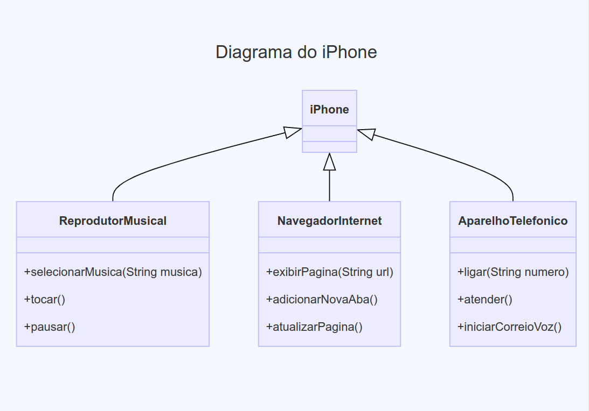

# Desafio da DIO
- Tema: UML, diagrama de classes e programação orientada a objetos com Java
- Desafios: criar um diagrama de classes do modelo do primeiro iPhone e implementar tal diagrama na linguagem Java

---

## Resultado
- Diagrama

---

# Site utilizado para criar o diagrama
- [Mermaid Chart](https://www.mermaidchart.com/)
